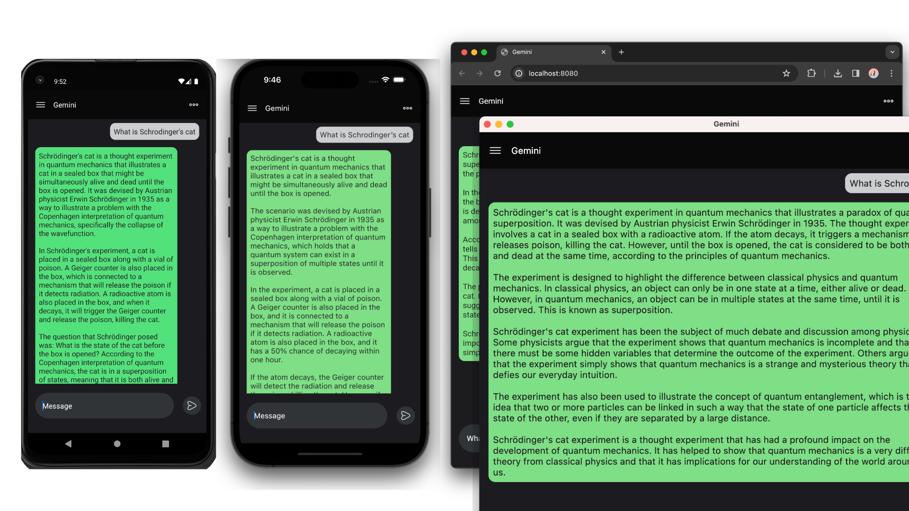

# KMP - Chat Application Powered by Gemini

>Gemini chat application that seamlessly runs on Android, iOS, desktop, and web platforms. It leverages Kotlin Multiplatform to share code and functionality across these environments, ensuring a consistent user experience. The application is powered by Gemini.

**Kotlin Multiplatform** project with Compose multiplatform clients along with Ktor. Currently running on
- Android
- iOS
- Web
- Desktop

>## Key Features

<b>Cross-platform compatibility:</b> Engage in conversations from any device, including smartphones, tablets, desktops, and web browsers. 
<b>Powered by Gemini:</b> Experience insightful, informative, and engaging conversations with a language model that rivals ChatGPT. 
<b>Kotlin Multiplatform foundation:</b> Benefits from code sharing, reduced development time, and a consistent codebase for multiplatform development. 
 

### Building

Use Android Studio/IntelliJ to build/run Android client. 
Requires XCode 14 or later for iOS client.
